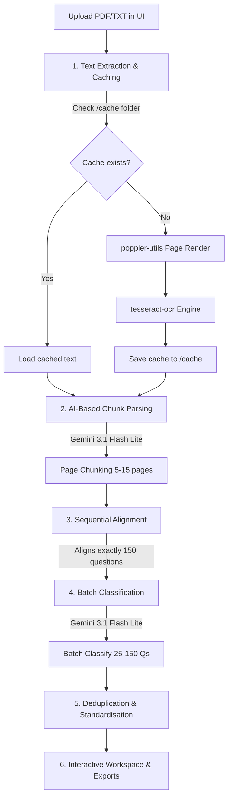

# ⚡ Qunify AI: Automated Exam Parser & Classifier

---

## 🛠️ Architecture & Workflow



---

## ✨ Features

- **Double-LLM Pipeline**: Separate models and settings for the extraction task and the classification task.
- **Dynamic Optimization Settings**:
  - Adjust page chunk sizes for extraction to stay within Gemini token limits.
  - Adjust batch sizes for classification (run up to 150 questions in a single call to eliminate API rate limits).
- **Interactive Verification Grid**: Preview extracted questions in real-time, override categories manually, and check snippets.
- **TeeLogger Engine**: Outputs all operational logs to a local file `run.log`, overwriting itself on each run for easy debugging.
- **Deduplication Engine**: Cleans up duplicate JSON returned by the model and automatically prefers valid classes over "Unclassified".
- **Multi-Format Exports**: Export your final classified questions directly as `.md`, `.csv`, or `.txt` mapping files.

---

## 🚀 Setup & Installation

### System Requirements
Before running, you must install the native OCR and PDF rendering libraries on your machine.

#### macOS
```bash
brew install tesseract poppler
```

#### Ubuntu / Debian
```bash
sudo apt-get install -y tesseract-ocr poppler-utils
```

### Application Setup
1. Clone the repository:
   ```bash
   git clone https://github.com/abhinavppradeep/Question_classify_AI_agent.git
   cd Question_classify_AI_agent
   ```
2. Create and activate a virtual environment:
   ```bash
   python3 -m venv venv
   source venv/bin/activate
   ```
3. Install dependencies:
   ```bash
   pip install -r requirements.txt
   ```
4. Set up your environment variables:
   Create a `.env` file in the root directory:
   ```env
   GEMINI_API_KEY=your_gemini_api_key_here
   ```

---

## 💻 How to Run

### Option 1: Streamlit Web Interface (Recommended)
Run the following command to start the interactive workspace:
```bash
streamlit run app.py
```
Open **[http://localhost:8501](http://localhost:8501)** in your browser.

### Option 2: Command Line Interface (CLI)
You can run the extraction pipeline headless via terminal:
```bash
python main.py --pdf path/to/paper.pdf --extraction-model gemini-3.1-flash-lite --classification-model gemini-3.1-flash-lite --chunk-size 10 --batch-size 75
```

---

## ☁️ Deploying to the Cloud (Free hosting)

This repository includes a `packages.txt` file configured to automatically install system dependencies on cloud hosts.

### Deploy on Streamlit Community Cloud:
1. Log in to [Streamlit Share](https://share.streamlit.io/).
2. Click **New app** and connect your GitHub repository `Question_classify_AI_agent`.
3. Set the Main file path to `app.py`.
4. Click **Deploy**! The server will build and run automatically.
